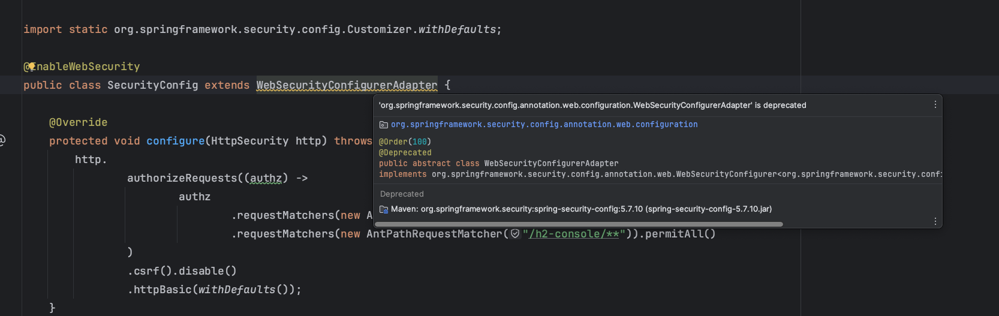

Spring Security is currently being managed by the Spring Boot Parent. You'll see the Spring Security starter in the `pom.xml` defined like:

```editor:select-matching-text
file: ~/exercises/pom.xml
text: "spring-boot-starter-security"
before: 2
after: 1
```

```xml
<dependency>
	<groupId>org.springframework.boot</groupId>
	<artifactId>spring-boot-starter-security</artifactId>
</dependency>
```

Currently, however, Spring Dependencies is tracking the latest Spring Security `5.7.x` release. You can verify this with the Maven Dependency Tree plugin:

```dashboard:open-dashboard
name: Terminal
```

```shell
[~/exercises] $ ./mvnw dependency:tree | grep spring-security
[INFO] |  +- org.springframework.security:spring-security-config:jar:5.7.10:compile
[INFO] |  |  \- org.springframework.security:spring-security-core:jar:5.7.10:compile
[INFO] |  |     \- org.springframework.security:spring-security-crypto:jar:5.7.10:compile
[INFO] |  \- org.springframework.security:spring-security-web:jar:5.7.10:compile
```

Notice that the Spring Security Version is set to `5.7.10`.

To prepare for Spring Security 6, you'll need to update the Spring Security version to follow the `5.8.x` release. This can be accomplished by overriding the Spring Security version placeholder established by the Spring Boot parent.

Let's run through an entire **SCAR** pass to update our Spring Security version.

## Make a **S**mall Change

```editor:select-matching-text
file: ~/exercises/pom.xml
text: "<properties>"
before: 0
after: 3
```

Add the Spring Security version property:

```xml
<properties>
	<java.version>17</java.version>
    <!-- add the property below -->
	<spring-security.version>5.8.5</spring-security.version>
</properties>
```

You're utilizing the same practice we previously discussed regarding moving versions to Maven Properties.

In this case, however, `spring-security.version` _has already been established by the Spring Boot Parent_ and you're free to override it here, locally, in your own `pom.xml` file. Maven will use this property to override the one previously set by the Spring Boot Parent.

That was truly a **S**mall Change. Let's compile and see the impact.

## **C**ompile the code

Now **C**ompile the code. You should see some interesting output.

```dashboard:open-dashboard
name: Terminal
```

```shell
[~/exercises] $ ./mvnw clean compile
...
[INFO] /course-spring-boot-2-7-to-3-1-upgrade-code/src/main/java/example/cashcard/SecurityConfig.java: /course-spring-boot-2-7-to-3-1-upgrade-code/src/main/java/example/cashcard/SecurityConfig.java uses or overrides a deprecated API.
[INFO] /course-spring-boot-2-7-to-3-1-upgrade-code/src/main/java/example/cashcard/SecurityConfig.java: Recompile with -Xlint:deprecation for details.
[INFO] ------------------------------------------------------------------------
[INFO] BUILD SUCCESS
[INFO] ------------------------------------------------------------------------
```

The code _does_ still compile successfully, but you should still see the **deprecation messages** `... SecurityConfig.java uses or overrides a deprecated API`.

Before we deal with that, we should verify that we _are_, in fact, using Spring Security 5.8.x.

```dashboard:open-dashboard
name: Terminal
```

```shell
[~/exercises] $ ./mvnw dependency:tree | grep spring-security
```

You should see the following output:

```shell
[INFO] |  +- org.springframework.security:spring-security-config:jar:5.8.5:compile
[INFO] |  |  \- org.springframework.security:spring-security-core:jar:5.8.5:compile
[INFO] |  |     \- org.springframework.security:spring-security-crypto:jar:5.8.5:compile
[INFO] |  \- org.springframework.security:spring-security-web:jar:5.8.5:compile
```

Great! Now let's go deal with deprecations.

## **A**ssess the results

Take a look at that compile output again:

```shell
[INFO] /course-spring-boot-2-7-to-3-1-upgrade-code/src/main/java/example/cashcard/SecurityConfig.java: /course-spring-boot-2-7-to-3-1-upgrade-code/src/main/java/example/cashcard/SecurityConfig.java uses or overrides a deprecated API.
[INFO] /course-spring-boot-2-7-to-3-1-upgrade-code/src/main/java/example/cashcard/SecurityConfig.java: Recompile with -Xlint:deprecation for details.
[INFO] ------------------------------------------------------------------------
[INFO] BUILD SUCCESS
[INFO] ------------------------------------------------------------------------
```

### Update our notes.

Add a new section `Major Release Considerations` to our `upgrade-notes.md` file.

```editor:open-file
file: ~/exercises/upgrade-notes.md
```

```markdown
- Upgrade Spring Security to `5.8.5`
- Spring Security deprecations
  - [INFO] /course-spring-boot-2-7-to-3-1-upgrade-code/src/main/java/example/cashcard/SecurityConfig.java: /course-spring-boot-2-7-to-3-1-upgrade-code/src/main/java/example/cashcard/SecurityConfig.java uses or overrides a deprecated API.
  - [INFO] /course-spring-boot-2-7-to-3-1-upgrade-code/src/main/java/example/cashcard/SecurityConfig.java
  - Reference: https://docs.spring.io/spring-security/reference/5.8/migration/index.html
```

## **R**eact to the error output

Lets address the deprecations using the `SCAR` method.

Most modern IDE's will help you understand what has been deprecated.

When you continue in the next step of the this lab, the Editor will show you the deprecation in the `SecurityConfig` class:

```editor:select-matching-text
file: ~/exercises/src/main/java/example/cashcard/SecurityConfig.java
text: "extends WebSecurityConfigurerAdapter"
```

")

Here's what it would look like in IntelliJ:


