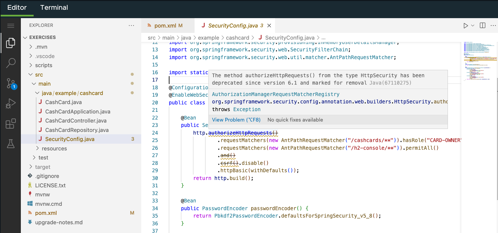

The first deprecation to deal with is the `http.authorizeHttpRequests()` method. It was deprecated starting in Spring Security 6.1, in favor of a new `Customizer` interface.

We need to rewrite the expression supporting the new method signature. That's going to be easiest using a lamba expression.

We're also going to remove the `and()`, as that conjunction function is no longer required.

1. Review `http.authorizeHttpRequests`.

   Let's start by opening the `SecurityConfig`.

   ```editor:select-matching-text
   file: ~/exercises/src/main/java/example/cashcard/SecurityConfig.java
   text: "authorizeHttpRequests()"
   after: 2
   ```

   Note that `http.authorizeHttpRequests` is now deprecated.

   ```java
   ...
   http.authorizeHttpRequests() // <== Deprecated since version 6.1!
              .requestMatchers(new AntPathRequestMatcher("/cashcards/**")).hasRole("CARD-OWNER")
              .requestMatchers(new AntPathRequestMatcher("/h2-console/**")).permitAll()
   ...
   ```

   

1. Update `http.authorizeHttpRequests` to use the new functional interface using a lamba expression.

   Rewrite using the new `Customizer` interface. The framework will provide a default `Customizer`.

   ```java
   ...
   http
      .authorizeHttpRequests((authCustomizer) -> authCustomizer
                  .requestMatchers(new AntPathRequestMatcher("/cashcards/**")).hasRole("CARD-OWNER")
                  .requestMatchers(new AntPathRequestMatcher("/h2-console/**")).permitAll())
          .csrf().disable()
          .httpBasic(withDefaults());
   ...
   ```

1. **C**ompile the code

   Now is a good time to **C**ompile the code again.

   ```dashboard:open-dashboard
   name: Terminal
   ```

   ```shell
   [~/exercises] $ ./mvnw clean compile
   ```

   Hey, progress! The code still compiles and two (2) of our deprecation messages are gone...only one (1) remaining.

   ```shell
   ...
   [WARNING] ... src/main/java/example/cashcard/SecurityConfig.java:[28,17] csrf() in org.springframework.security.config.annotation.web.builders.HttpSecurity has been deprecated and marked for removal
   [INFO] ------------------------------------------------------------------------
   [INFO] BUILD SUCCESS
   [INFO] ------------------------------------------------------------------------
   [INFO] Total time:  1.939 s
   [INFO] Finished at: 2023-10-03T09:30:34-06:00
   [INFO] ------------------------------------------------------------------------
   ```

1. Update our notes.

   Before we move on, let's note the change in the `upgrade-notes.md` file.

   ```editor:open-file
   file: ~/exercises/upgrade-notes.md
   ```

   ```markdown
   - Update `http.authorizeHttpRequests` to use the new customizer interface
   ```

Next, let's deal with the remaining `csrf()` depredation.
